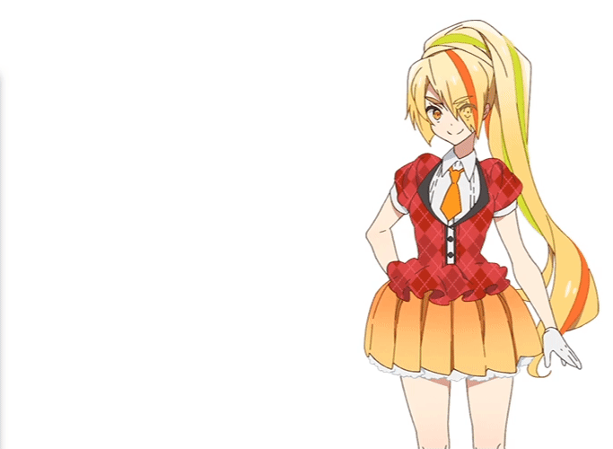

# Jahy for Twitch (but not only Jahy)

"Jahy for twitch" is cute Live2D character reacting to streamlabs alert (only twitch event and streamlabs donation). When you receive an alert, a proper animation is triggered with a customable text.
Coded in html/css/raw javascript (ES6), you can display this cute character in your OBS scenes for your stream.
Nearly every alerts are handled :
- Follow
- Subscription
- Resubscription
- Raid
- Host
- Donation
- Subgift (beta)
- Subbomb (beta)
- All bits stages :
  * 1 bit
  * 100 bits
  * 1000 bits
  * 5000 bits
  * 10000 bits

Spread Jahy over twitch !!

### Image and other waifu

With the new configuration page, you can replace Jahy with any character you want. Also It doesn't have to be an animation/video, it work with images/gifs too !
The wiki page will explain to you all the customable options to setup your own character.

## Exemples

Video/Animation exemple :


Image exemple :


# Getting Started

### Prerequisites

```
- OBS / streamlabs-OBS / (maybe work with XSplit)
- Your Streamlabs websocket token
```

### Installing

* Open the page "config.html" with your favorite browser.
* Click on "Tutorial & Wiki" button, and follow the tutorial in it.

## Built With

* [streamlabs-socket-client](https://github.com/tehkhop/streamlabs-socket-client) - The websocket client used to connect to streamlabs
* [GSAP TweenMax](https://greensock.com/gsap) - Framework for easy text and bubble speech animation

## Future update

* Create a new websocket connection to twitch chat. Your character will be able to react to what people say ! Some keyword will trigger an animation + text !
* Code the script and create some animations when nothing happen in a long time (no alerts since 15min/20min/etc...)

## Authors

Project created by 0ne3y3.
[My twitter](https://twitter.com/OneEYE_Lucas)

Big thank to my friend Alzcats, the artist who draw the character :
[His twitter](https://twitter.com/alzcats)
